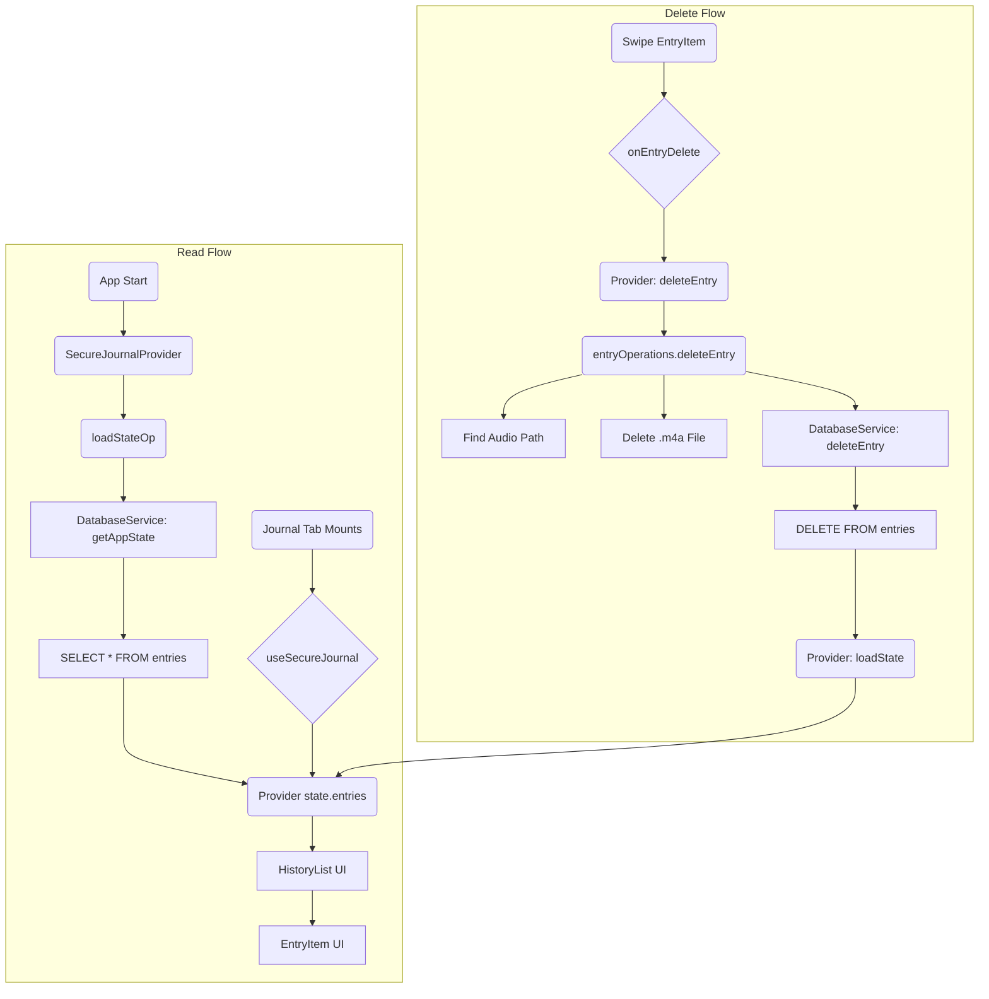

# Feature Flow: The Journal & Storage Journey

This document explains how your journal entries are loaded, displayed, managed, and securely stored. This flow is the backbone of the app, ensuring your data is fast, safe, and persistent.

The journey covers two main parts:

1.  **The Read Flow:** How your entries get from the database to your screen.
2.  **The Delete Flow:** What happens when you swipe to delete an entry.
3.  **The "Vault":** How your data is physically and securely stored on the device.

### High-Level Flow: Read & Delete

-----

## 1\. The "Aha\!" Moment: Loading Your Journal

When you first open the app, your journal appears to load instantly. This is by design, as all the heavy lifting happens the moment the app launches.

1.  **App Start (`app/_layout.tsx`):** The moment your app launches, it wraps everything in the `SecureJournalProvider`.
2.  **Provider Wakes Up (`SecureJournalProvider.tsx`):** On its first mount, the provider kicks off its initialization. It calls `initializeServices()` to open the **SQLite database** and then immediately calls `loadStateOp()` (from `stateLoader.ts`).
3.  **The "Ledger" (`DatabaseService.ts`):** `loadStateOp()` calls `databaseService.getAppState()`. This service runs the SQL query `SELECT * FROM entries ORDER BY date DESC` against the `plantalk.db` file on your device.
4.  **State is Hydrated:** The provider receives the full list of journal entries and stores them in its internal React state (`state.entries`).
5.  **You Tap "Journal" (`app/(tabs)/journal.tsx`):** Now, when you tap the journal tab, the `JournalScreen` mounts. It calls `useSecureJournal()`, which *instantly* retrieves the `state.entries` array that was already loaded in step 4.

There's no loading spinner because, by the time you navigate to the screen, the data is already in memory, ready to be displayed.

-----

## 2\. Making it Pretty: Rendering the List

Once `journal.tsx` has the list of entries, it doesn't just show them.

1.  **Grouping:** A `useMemo` hook in `journal.tsx` runs, sorting all your entries into human-friendly sections: "Today," "Yesterday," "Previous 7 Days," etc.
2.  **The List UI (`HistoryList.tsx`):** This component takes the sectioned data and renders the list, creating a `<View>` for each section.
3.  **The Row UI (`EntryItem.tsx`):** `HistoryList` renders an `EntryItem` for each entry in a section. This component is responsible for displaying the title, text preview, and duration. It's also the component that handles the swipe-to-delete gesture.

-----

## 3\. The "Swipe-to-Delete" Action

When you swipe left on an entry, you are interacting directly with `EntryItem.tsx`.

1.  **The Gesture:** `EntryItem.tsx` uses `react-native-gesture-handler` to track your finger's movement.
2.  **The "Delete" Tap:** When you tap the red "Delete" button that appears, the `handleDeletePress()` function is called inside the `EntryItem`.
3.  **The Callback:** This function calls the `onEntryDelete(item.id)` prop, which was passed down from `journal.tsx`.
4.  **The Handoff:** `journal.tsx` receives this call and executes the main function from the provider: `deleteEntry(entryId)`.

-----

## 4\. The "Core" Logic: Deleting an Entry

This is where your app's architecture ensures no data is left behind. The `SecureJournalProvider` delegates the complex work to `entryOperations.ts`.

The `entryOperations.deleteEntry` function performs two critical, separate actions in order:

1.  **Delete the Audio File:**

      * It first reads the entry from the database to get its `audioUri` (e.g., `audio/audio_123.m4a`).
      * It passes this **relative path** to `getAbsoluteAudioPath()` (from `shared/utils/audioPath.ts`).
      * This utility constructs the full, **absolute path** (e.g., `file:///var/mobile/.../Documents/audio/audio_123.m4a`).
      * It then uses `FileSystem.deleteAsync()` to permanently delete the `.m4a` file from your device's storage.

2.  **Delete the Database Row:**

      * After the file is gone, it calls `databaseService.deleteEntry(entryId)`.
      * `DatabaseService.ts` executes the SQL command: `DELETE FROM entries WHERE entryId = ?`.

Once the operation is complete, the `deleteEntry` function in the provider calls `loadState()` again. This re-queries the database, gets the new (shorter) list of entries, updates the provider's state, and React automatically removes the item from your screen.

-----

## 5\. The "Vault": How Storage *Actually* Works

Your journal data isn't just one big file. It's a robust system of three distinct parts that work together.

### The Ledger: `DatabaseService.ts`

This service controls your **SQLite database** (`plantalk.db`). This file is the "ledger" or "index" for your entire journal. It stores all the metadata:

  * `id`, `date`, `title`
  * The `text` (refined transcription) and `rawText`
  * `processingStage` (e.g., 'completed')
  * `audioUri` (The **relative path** to the audio file)

### The Keymaker: `SecureStorageService.ts`

This service *does not* store your journal entries. It manages your app's most sensitive secrets by storing them in the device's hardware-backed secure enclave:

  * **iOS:** Keychain
  * **Android:** Keystore / EncryptedSharedPreferences

It holds things like the `migration_completed` flag and, in the future, could hold the encryption key for the database itself.

### The Vault: The File System

This is the physical `Documents/` directory in your app's sandboxed storage. Your large `.m4a` audio files live here, inside an `audio/` sub-folder. The `DatabaseService` only stores the *name* of the file (the relative path); the File System stores the *file itself*.

This separation is what makes your app so robust:

  * **Fast:** Loading the journal only requires reading the lightweight SQLite database, not all the audio files.
  * **Safe:** By storing **relative paths** (thanks to `audioPath.ts`), the app can always find your audio files, even if an iOS update moves the app's physical storage location.
  * **Secure:** Sensitive data lives in the database, while secrets live in the device's keychain.
  