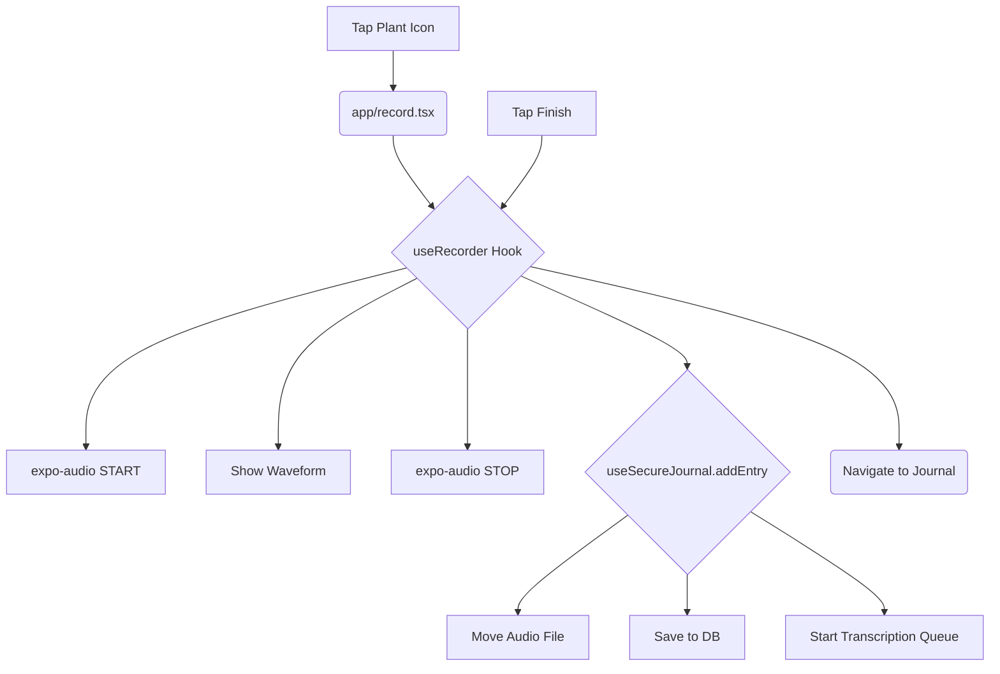

# Feature Flow: The Recording Journey

This document walks you through the entire recording flow, from the moment you tap the record button to the second your entry appears in the journal, ready for processing.

The primary design goal is **zero friction**. The app handles all the complexity so you can just talk.

### High-Level Flow



-----

## 1\. The Trigger: Tapping the Plant

The journey begins on the main tab (`app/(tabs)/index.tsx`). When you tap the plant icon, a single function, `handlePlantPress`, is called. This function does only one thing:

```typescript
router.push('/record');
```

This navigates you to the dedicated recording screen.

-----

## 2\. The Recording Screen (`app/record.tsx`)

This screen's only job is to be the "face" of the recording process. All the logic is handled by a hook from our `features` directory.

As soon as `app/record.tsx` mounts, it immediately calls `useRecorder()`. This hook, located at `src/features/recording/hooks/useRecorder.ts`, instantly takes control.

-----

## 3\. The "Brain": `useRecorder()` Hook

This hook is the heart of the recording experience. The moment it's initialized, a `useEffect` hook fires and calls `startRecordingAutomatically()`.

This single function orchestrates the entire setup:

1.  **Asks for Permission:** It uses `AudioModule.requestRecordingPermissionsAsync()` to request microphone access. If you deny permission, it shows an alert and sends you back.
2.  **Configures the Audio Session:** It calls `setAudioModeAsync()`, setting flags like `shouldPlayInBackground: true`. This is crucial for ensuring your recording **continues even if you lock your screen** or switch apps.
3.  **Starts Recording:** It calls `audioRecorder.prepareToRecordAsync()` and then `audioRecorder.record()` using the `expo-audio` library.
4.  **Activates the Waveform:** It calls `startMetering()`, which begins polling `expo-audio` for amplitude data. This data feeds the live `<Waveform />` component, giving you visual feedback that the app is listening.

At this point, you are actively recording. The UI shows a running timer and two options: "Pause" and "Finish".

-----

## 4\. The "Handoff": Finishing the Recording

When you tap the checkmark, you trigger `handleFinishRecording()` in the `useRecorder` hook. This is the most critical handoff in the app.

Here’s the play-by-play:

1.  **UI Update:** The state is set to `'saving'`, so you see a "Saving..." indicator.

2.  **Stop Hardware:** `audioRecorder.stop()` is called to finalize the recording and save the `.m4a` file to a temporary cache directory on your device.

3.  **Get the File:** The hook gets the temporary `uri` (file path) of the newly created audio file.

4.  **Call the Provider:** This is the handoff. The hook calls `addEntry()` from the `useSecureJournal()` context, passing it the `uri`, `duration`, and placeholder text:

    ```typescript
    // Inside useRecorder.ts
    await addEntry({
      date: new Date().toISOString(),
      title: 'Processing...', // Placeholder title
      text: '', // Empty text
      rawText: '',
      duration,
      audioUri: uri, // The temporary file path
      processingStage: 'transcribing', // Set the starting stage
    });
    ```

5.  **Navigate Away:** With its job done, the hook immediately navigates you to the journal tab with `router.replace('/(tabs)/journal')`. You never see the "Saving..." state for more than a fraction of a second.

-----

## 5\. The "Core": `SecureJournalProvider` Takes Over

The `addEntry` function you called lives in `SecureJournalProvider.tsx`. This provider acts as the central orchestrator, delegating the work to specialized services from `src/core/`.

When `addEntry` is called, it triggers a chain of operations defined in `src/core/providers/journal/operations/entryOperations.ts`:

1.  **Secure the Audio:** It calls `moveAudioToPermanentStorage(tempUri)`. This helper function moves your audio file from the temporary cache to a permanent, secure directory. Crucially, it returns a **relative path** (e.g., `audio/audio_123.m4a`). Storing a relative path ensures the app can always find the file, even if iOS changes the app's container ID during an update.
2.  **Save to Database:** It calls `databaseService.addEntry()`. This writes the new journal entry into the **SQLite database** with the permanent *relative* audio path and `processingStage: 'transcribing'`.
3.  **Start the Pipeline:** Finally, it calls `transcriptionService.addToQueue()`, handing off the entry ID and audio path to the background processing service.
4.  **Refresh the UI:** The provider reloads its state from the database, which instantly updates the `app/(tabs)/journal.tsx` screen.

### The Journey's End (For Now)

The recording flow is officially complete.

You are now on the Journal screen, and the new entry you just recorded appears at the top of the list. It shows the "Processing..." title because the `TranscriptionService` has just picked up the job and is beginning the process described in the **Transcription Pipeline** flow.
